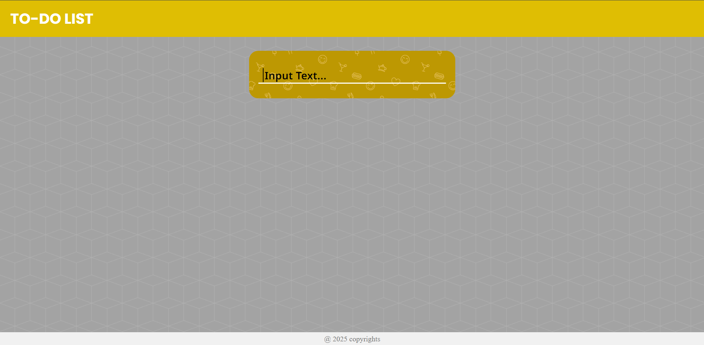
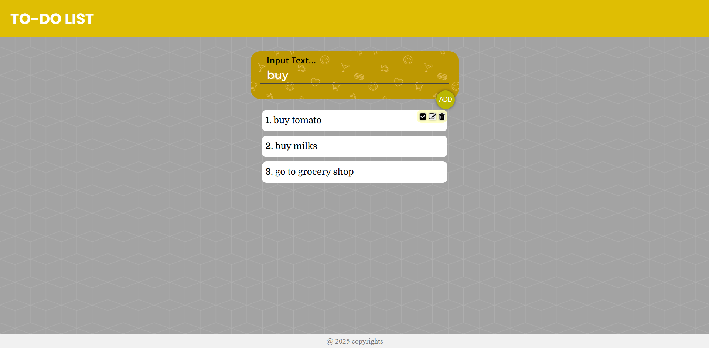

# React + Vite

This template provides a minimal setup to get React working in Vite with HMR and some ESLint rules.

Currently, two official plugins are available:

- [@vitejs/plugin-react](https://github.com/vitejs/vite-plugin-react/blob/main/packages/plugin-react) uses [Babel](https://babeljs.io/) for Fast Refresh
- [@vitejs/plugin-react-swc](https://github.com/vitejs/vite-plugin-react/blob/main/packages/plugin-react-swc) uses [SWC](https://swc.rs/) for Fast Refresh

## Expanding the ESLint configuration

If you are developing a production application, we recommend using TypeScript with type-aware lint rules enabled. Check out the [TS template](https://github.com/vitejs/vite/tree/main/packages/create-vite/template-react-ts) for information on how to integrate TypeScript and [`typescript-eslint`](https://typescript-eslint.io) in your project.

# 📝 Simple Todo List App

A minimal Todo List application built with **React** and **Vite**.  
Add, mark as complete, and delete tasks in a clean and simple UI.

---

## 🔧 Tech Stack

- ⚛️ React (with Hooks)
- ⚡ Vite (for fast dev + build)
- 💅 CSS (optional: Tailwind or custom styles)

---

## 📂 Project Structure

<pre lang="markdown"> ``` 📁 my-todo-app/ ├── public/ │ ├── scripts/ │ ├── style/ │ │ ├── main.css ├── src/ │ ├── assets/ │ ├── components/ # To-Do components │ │ ├── main/ │ │ │ ├── CreateList.jsx │ │ │ ├── TodoList.jsx │ │ │ ├── ToDo.jsx │ │ ├── Footer.jsx │ │ ├── NavBar.jsx │ ├── App.jsx │ ├── main.jsx # Main app component ├── .gitignore ├── index.html ├── package.json ├── vite.config.js └── README.md ``` </pre>

---

## 🚀 Getting Started

### 1. Clone the repository 

```bash

git clone https://github.com/Surya-Prakash-S-hub/UM-Projects.git/project-lists/Project-1/To-Do-List-App
cd my-todo-app

```

### 2. Install dependencies

npm install

### 3. Start the development server

npm run dev

App runs at: (http://localhost:5173)

## 📦 Build for production

npm run build

### To preview the production build:

npm run preview

📸 Screenshot



