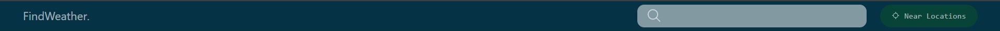
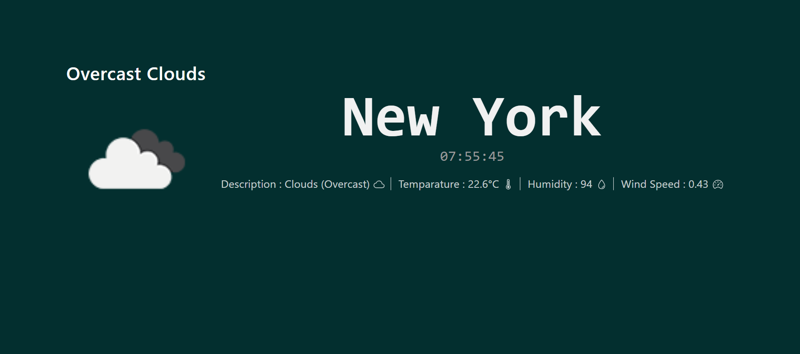
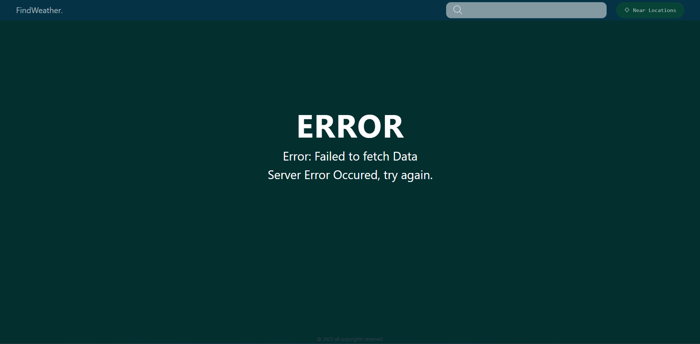
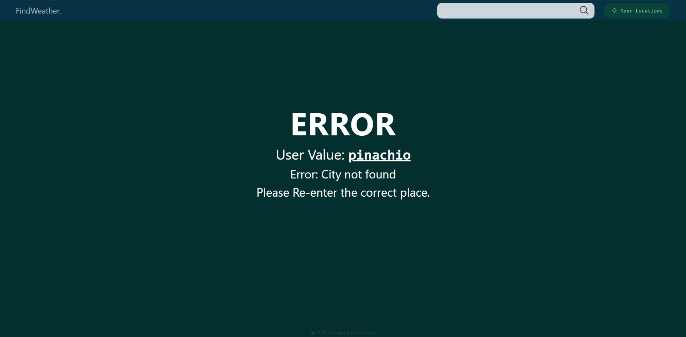

# 🌤️ Weather App — Fullstack React + Node.js

A weather forecast web application that fetches **real-time weather** and **last-day & previous-day forecasts** from the [OpenWeather API](https://openweathermap.org/).  

You can:
- 🌍 Search any city and view weather data
- 🌡️ Get temperature in °C
- 💧 View humidity percentage
- 🌬️ See wind speed
- 🖼️ Display weather icons
- 📜 Read weather descriptions

---

## 📑 Table of Contents
- [✨ Features](#-features)
- [🛠️ Requirements](#%EF%B8%8F-requirements)
- [🔑 Get Your OpenWeather API Key](#-get-your-openweather-api-key)
- [🎨 TailwindCSS Setup (Frontend with Vite)](#-tailwindcss-setup-frontend-with-vite)
- [⚙️ Backend Setup](#%EF%B8%8F-backend-setup)
- [💻 Frontend Setup](#-frontend-setup)
- [📦 Install Dependencies](#-install-dependencies)
- [▶️ Running the App Locally](#%EF%B8%8F-running-the-app-locally)
- [🚀 Deployment Guide](#-deployment-guide)
- [📸 Screenshots](#-screenshots)
- [📜 License](#-license)

---

### ✨ Features
✅ Search for any location  
✅ Shows weather icons 🖼️  
✅ Displays humidity, temperature, wind speed  
✅ Uses `.env` for secure API keys 🔒  
✅ Fullstack app with Express backend + React frontend  

---

### 🛠️ Requirements
- **Node.js** (>=16)
- **npm** or **yarn**
- **OpenWeather API Key** — [Get it here](https://openweathermap.org/api)
- Internet connection

---

### 🔑 Get Your OpenWeather API Key
1. Visit [OpenWeather Sign Up](https://home.openweathermap.org/users/sign_up) 🌐
2. Create a free account
3. Go to your [API Keys page](https://home.openweathermap.org/api_keys)
4. Copy your API key
5. Create a `.env` file in your **backend** and add:
   PORT=4000
   API_KEY=your_openweather_api_key
   WEATHER_API=https://api.openweathermap.org/data/2.5/weather


---

### 🎨 TailwindCSS Setup (Frontend with Vite)

This project uses **TailwindCSS** for styling. If you are setting up from scratch, follow these steps:

### 1️⃣ Install TailwindCSS & dependencies
```bash
cd weather-app
npm install -D tailwindcss postcss autoprefixer
npx tailwindcss init -p

```

### ⚙️ Backend Setup
Folder structure:

backend/
│── node_modules/
│── package.json
│── server.js
│── .env


### 📦 Dependencies Used

express — backend framework
ejs — for templating
dotenv — load .env variables
nodemon — auto-restart server on changes


### 💻 Frontend Setup
Main Folder: weather-app/ (React + Vite)

Structure:

weather-app/
│── src/
│   ├── components/
│   │   ├── LandingPage.jsx
│   │   ├── Report.jsx
│   │   ├── NavBar.jsx
│   │   ├── Footer.jsx
│── package.json
│── vite.config.js
│── .env


### 📦 Install Dependencies

Install backend packages:
cd backend
npm install
npm install nodemon --save-dev

Install frontend packages:
bash
Copy
Edit
cd weather-app
npm install

### ▶️ Running the App Locally
Start backend:

cd backend
npm run dev   # Runs with nodemon

Backend runs at: http://localhost:4000

Start frontend:
cd weather-app
npm run dev
Frontend runs at: http://localhost:5173


### 🚀 Deployment Guide

1. Clone this repo
git clone <https://github.com/Surya-Prakash-S-hub/UM-Projects/tree/main/project-lists/Project-2>

2. Install dependencies
Follow the 📦 Install Dependencies section above.

3. Environment Variables
Make sure .env files exist in backend and frontend with the correct values.

4. Production Build (React)
cd weather-app
npm run build
This creates a dist/ folder with production-ready frontend files.

5. Serve Production Build
You can serve dist/ from:

Express backend (using express.static)

Services like Vercel, Netlify, or Render

### 📸 Screenshots

Navigation Bar:


Main Content:


Footer:


Error: server side


Error: City not found


Overview:


### 📜 License

This project is open-source and available under the MIT License.

💡 Pro Tip:

Made with ❤️ using React + Node.js

If you want to modify this app for your own use, just update the .env with your API key, and customize the components inside src/components/.


THANKS FOR VISITING.